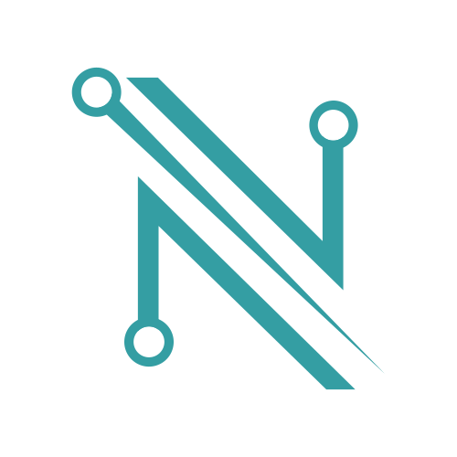

# NamiNative
The nami wallet chrome extension ported to react-native mobile app

</img>

# NamiNative

NamiNative is a mobile wallet to interact with the Cardano blockchain. It's an open-source project and built by [**Berry Pool**](https://pipool.online) and [**consensusMonky Pool**](https://consensusmonky.de).

### Testnet Preprod Version

[Download testnet version](./releases/NamiNative_v1.0.0.apk)

Download the APK and create a new wallet or restore an existing one.
Currently the wallet is only communicating with the preprod testnet.

The mainnet network will be added after some more tests.

### Early version

As NamiNative is still in development, nevertheless it is important for to get your feedback.
We build a product that combines the best features of the Chrome version with your best practices and experience in Web3.
Every idea and feedback from the community is welcome and should be directly incorporated into the product.

### Supported OS

Currently we only support android.
iOS will be integrated in the future.

### Libraries

The wallet and transaction specific data is generated with the cardano-serialization lib mobile bridge especially made for react-native.
https://github.com/Emurgo/csl-mobile-bridge

### Upcoming features

- Native token support
- NFT standards CIP-25, CIP-68 etc.
- dApp connector
- Ledger support
- NFT Viewer
- Spacebudz integration
- Wormhole integration

### Website

Visit [Berry Pool](https://pipool.online) 
Visit [consensusMonky Pool](https://consensusmonky.de)